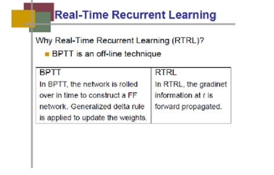
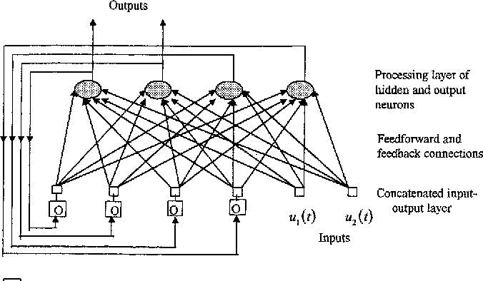
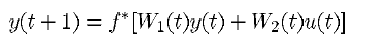
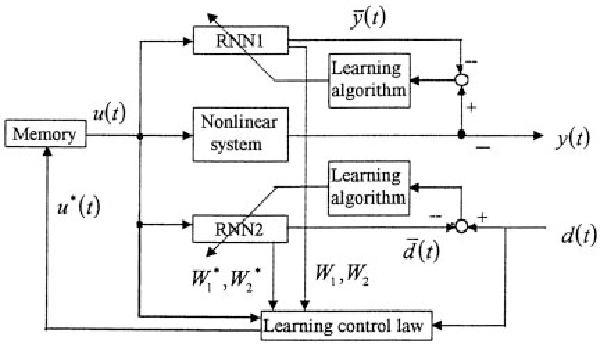
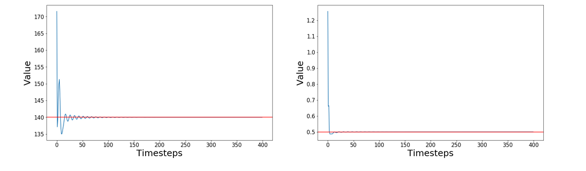
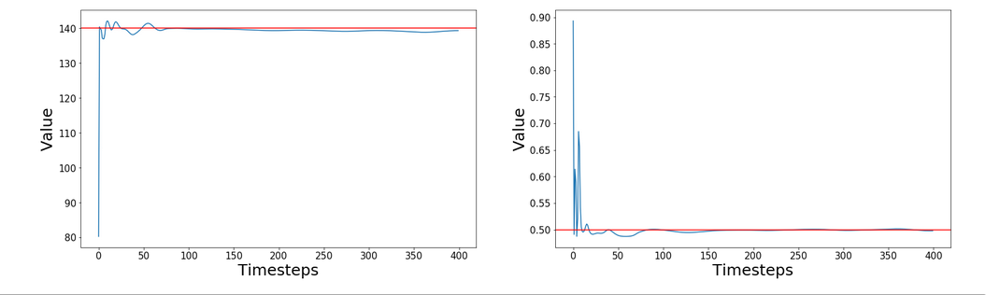
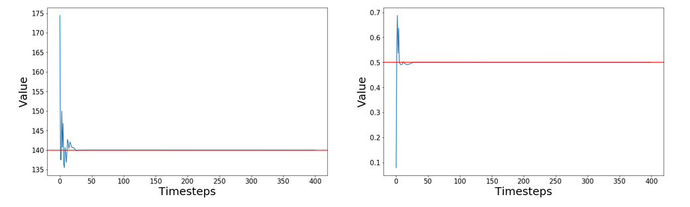
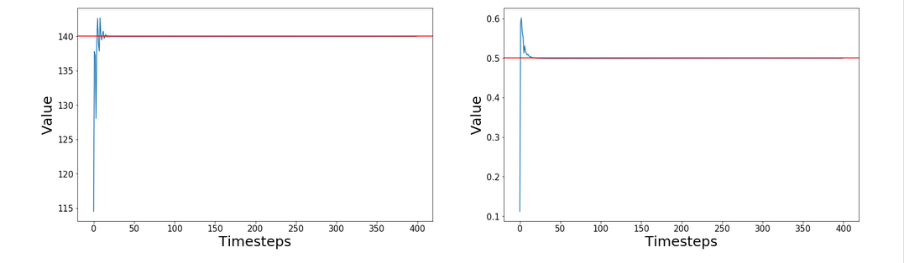

# Real-Time-Recurrent-Learning

## Introduction

This project utilizes a class of discrete-time Recurrent Neural Networks(RNNs) known as Real Time Recurrent Networks(RTRNs) to obtain the desired response of a dynamic
control system. The system considered is a Multi Input Multi Output(MIMO) system.

## Real Time Recurrent Learning(RTRL) v/s Back Propagation Through Time(BPTT)

- In general, vanilla neural networks are known to utilise BPTT as their learning algorithm. In case of RTRNs, the concept of    backpropagation doesn't exist.
That implies The gradient information at t + 1 is  forward  propagated  to  compute  the  gradient  information  at t + 2  and  so  on.   This  is  the  difference. 

- RTRL is a real-time or online technique, whereas BPTT is an offline technique.

- Since it is real time it means the data need not be collected over time from the system and then learn the model.
  The model will be learned as and when the data comes; most of the control problems must be dealt online.
  
  
                              

## Overview:

Two RTRNs, based on the same network architecture, are utilized in the learning control system. 

1. One is used to approximate the non- linear system
2. other is used to mimic the desired system response output. 

The learning rule is achieved by combining the two RTRNs to form the neural network control system.

An iterative learning control(ILC) algorithm is used to train the RTRNs. The learned weights at one time step are utilised in the next time step. The derivation is based on 2-D system theory and can be found in the reference number [1].

A 2-D nonlinear system mathematical model is used to describe the dynamics of the RTRNs the learning process. One dimension reflects the RTRN dynamics in the time domain and the other to reflect the iterative learning process.

## Learning algorithm:

When RTRNs are used to approximate and control an unknown nonlinear system through an on-line learning process, they may be considered as subsystems of an adaptive control system. The weights of the networks  are initiliased randomly and need to be updated using a dynamical learning algorithm during the control process.
  
  During the learning process, each variable of an RTRN depends on two independent variables; time(t) and iteration(k). For every time step (since discrete system is considered), both the RTRNs are trained separately in sequence till the error between the plant output and RTRN1 output & desired system response output and RTRN 2 output is brought under a certain threshold.
  
  

## Control:

The learned weights of both the RTRNs are combined together to establish a control rule. This control rule updates the control inputs U1 and U2 on per timestep basis and helps to  approximate the system output to the desired output.

## Dataset:

The dataset is obtained by hardcoding the dynamics(given in terms of equations) obtaining outputs corresponding to inputs. The equations are borrowed from [2], which is a paper on control and stability analysis for an autonomous helicopter. The columns represent factors like angular velocity, vertical veolicy, collective pitch angle etc.
  Note that the dataset is used only for obtaining values of mean and standard deviation for normalisiation purposes and chossing an arbitrary initial value. Nowhere are they required for the learning algorithm.

## Results:

1. The objective of this particular setup was to obtain a desired output of 140 for output 1 and 0.5 for output 2. This was achieved in about 50 time steps on average
and maintained constant throughout. 
2. The results had some issues with weight initialisations. On some rare occasions, the output didn't converge. So the model is a bit sensitive to initial values. 
3. Except the first few timesteps, only one iteration is required to converge for both the RTRNs.

Some of the plots of the plant output for different random number seeds are given below:

## References:

1. [IEEE](https://ieeexplore.ieee.org/document/661316/)
2. [Helicopter Paper](https://www.researchgate.net/publication/235919994_Three-time_scale_singular_perturbation_control_and_stability_analysis_for_an_autonomous_helicopter_on_a_platform)
3. NPTEL Electrical Engineering: Intelligent Systems and Control. (for the lecture slide)
